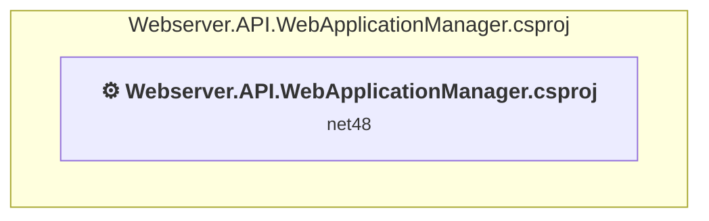

# Projects and dependencies analysis

This document provides a comprehensive overview of the projects and their dependencies in the context of upgrading to .NETCoreApp,Version=v10.0.

## Table of Contents

- [Executive Summary](#executive-Summary)
  - [Highlevel Metrics](#highlevel-metrics)
  - [Projects Compatibility](#projects-compatibility)
  - [Package Compatibility](#package-compatibility)
  - [API Compatibility](#api-compatibility)
- [Aggregate NuGet packages details](#aggregate-nuget-packages-details)
- [Top API Migration Challenges](#top-api-migration-challenges)
  - [Technologies and Features](#technologies-and-features)
  - [Most Frequent API Issues](#most-frequent-api-issues)
- [Projects Relationship Graph](#projects-relationship-graph)
- [Project Details](#project-details)

  - [src\WebAppManager\Webserver.API.WebApplicationManager.csproj](#srcwebappmanagerwebserverapiwebapplicationmanagercsproj)

## Executive Summary

### Highlevel Metrics

| Metric | Count | Status |
| :--- | :---: | :--- |
| Total Projects | 1 | All require upgrade |
| Total NuGet Packages | 21 | 5 need upgrade |
| Total Code Files | 36 |  |
| Total Code Files with Incidents | 28 |  |
| Total Lines of Code | 3736 |  |
| Total Number of Issues | 1005 |  |
| Estimated LOC to modify | 985+ | at least 26,4% of codebase |

### Projects Compatibility

| Project | Target Framework | Difficulty | Package Issues | API Issues | Est. LOC Impact | Description |
| :--- | :---: | :---: | :---: | :---: | :---: | :--- |
| [src\WebAppManager\Webserver.API.WebApplicationManager.csproj](#srcwebappmanagerwebserverapiwebapplicationmanagercsproj) | net48 | 🟡 Medium | 18 | 985 | 985+ | ClassicWinForms, Sdk Style = False |

### Package Compatibility

| Status | Count | Percentage |
| :--- | :---: | :---: |
| ✅ Compatible | 16 | 76,2% |
| ⚠️ Incompatible | 0 | 0,0% |
| 🔄 Upgrade Recommended | 5 | 23,8% |
| ***Total NuGet Packages*** | ***21*** | ***100%*** |

### API Compatibility

| Category | Count | Impact |
| :--- | :---: | :--- |
| 🔴 Binary Incompatible | 955 | High - Require code changes |
| 🟡 Source Incompatible | 4 | Medium - Needs re-compilation and potential conflicting API error fixing |
| 🔵 Behavioral change | 26 | Low - Behavioral changes that may require testing at runtime |
| ✅ Compatible | 4977 |  |
| ***Total APIs Analyzed*** | ***5962*** |  |

## Aggregate NuGet packages details

| Package | Current Version | Suggested Version | Projects | Description |
| :--- | :---: | :---: | :--- | :--- |
| Microsoft.Bcl.AsyncInterfaces | 9.0.8 | 10.0.3 | [Webserver.API.WebApplicationManager.csproj](#srcwebappmanagerwebserverapiwebapplicationmanagercsproj) | NuGet package upgrade is recommended |
| Microsoft.Extensions.DependencyInjection.Abstractions | 9.0.8 | 10.0.3 | [Webserver.API.WebApplicationManager.csproj](#srcwebappmanagerwebserverapiwebapplicationmanagercsproj) | NuGet package upgrade is recommended |
| Microsoft.Extensions.Logging.Abstractions | 9.0.8 | 10.0.3 | [Webserver.API.WebApplicationManager.csproj](#srcwebappmanagerwebserverapiwebapplicationmanagercsproj) | NuGet package upgrade is recommended |
| Microsoft.NETCore.Platforms | 1.1.0 |  | [Webserver.API.WebApplicationManager.csproj](#srcwebappmanagerwebserverapiwebapplicationmanagercsproj) | NuGet package functionality is included with framework reference |
| MimeMapping | 3.1.0 |  | [Webserver.API.WebApplicationManager.csproj](#srcwebappmanagerwebserverapiwebapplicationmanagercsproj) | ✅Compatible |
| NETStandard.Library | 2.0.3 |  | [Webserver.API.WebApplicationManager.csproj](#srcwebappmanagerwebserverapiwebapplicationmanagercsproj) | NuGet package functionality is included with framework reference |
| Newtonsoft.Json | 13.0.3 | 13.0.4 | [Webserver.API.WebApplicationManager.csproj](#srcwebappmanagerwebserverapiwebapplicationmanagercsproj) | NuGet package upgrade is recommended |
| Siemens.Simatic.S7.Webserver.API | 3.2.27 |  | [Webserver.API.WebApplicationManager.csproj](#srcwebappmanagerwebserverapiwebapplicationmanagercsproj) | ✅Compatible |
| System.Buffers | 4.6.1 |  | [Webserver.API.WebApplicationManager.csproj](#srcwebappmanagerwebserverapiwebapplicationmanagercsproj) | NuGet package functionality is included with framework reference |
| System.Diagnostics.DiagnosticSource | 9.0.8 | 10.0.3 | [Webserver.API.WebApplicationManager.csproj](#srcwebappmanagerwebserverapiwebapplicationmanagercsproj) | NuGet package upgrade is recommended |
| System.IO | 4.3.0 |  | [Webserver.API.WebApplicationManager.csproj](#srcwebappmanagerwebserverapiwebapplicationmanagercsproj) | NuGet package functionality is included with framework reference |
| System.Memory | 4.6.3 |  | [Webserver.API.WebApplicationManager.csproj](#srcwebappmanagerwebserverapiwebapplicationmanagercsproj) | NuGet package functionality is included with framework reference |
| System.Net.Http | 4.3.4 |  | [Webserver.API.WebApplicationManager.csproj](#srcwebappmanagerwebserverapiwebapplicationmanagercsproj) | NuGet package functionality is included with framework reference |
| System.Numerics.Vectors | 4.6.1 |  | [Webserver.API.WebApplicationManager.csproj](#srcwebappmanagerwebserverapiwebapplicationmanagercsproj) | NuGet package functionality is included with framework reference |
| System.Runtime | 4.3.1 |  | [Webserver.API.WebApplicationManager.csproj](#srcwebappmanagerwebserverapiwebapplicationmanagercsproj) | NuGet package functionality is included with framework reference |
| System.Runtime.CompilerServices.Unsafe | 6.1.2 |  | [Webserver.API.WebApplicationManager.csproj](#srcwebappmanagerwebserverapiwebapplicationmanagercsproj) | ✅Compatible |
| System.Security.Cryptography.Algorithms | 4.3.1 |  | [Webserver.API.WebApplicationManager.csproj](#srcwebappmanagerwebserverapiwebapplicationmanagercsproj) | NuGet package functionality is included with framework reference |
| System.Security.Cryptography.Encoding | 4.3.0 |  | [Webserver.API.WebApplicationManager.csproj](#srcwebappmanagerwebserverapiwebapplicationmanagercsproj) | NuGet package functionality is included with framework reference |
| System.Security.Cryptography.Primitives | 4.3.0 |  | [Webserver.API.WebApplicationManager.csproj](#srcwebappmanagerwebserverapiwebapplicationmanagercsproj) | NuGet package functionality is included with framework reference |
| System.Security.Cryptography.X509Certificates | 4.3.2 |  | [Webserver.API.WebApplicationManager.csproj](#srcwebappmanagerwebserverapiwebapplicationmanagercsproj) | NuGet package functionality is included with framework reference |
| System.Threading.Tasks.Extensions | 4.6.3 |  | [Webserver.API.WebApplicationManager.csproj](#srcwebappmanagerwebserverapiwebapplicationmanagercsproj) | NuGet package functionality is included with framework reference |

## Top API Migration Challenges

### Technologies and Features

| Technology | Issues | Percentage | Migration Path |
| :--- | :---: | :---: | :--- |
| WPF (Windows Presentation Foundation) | 400 | 40,6% | WPF APIs for building Windows desktop applications with XAML-based UI that are available in .NET on Windows. WPF provides rich desktop UI capabilities with data binding and styling. Enable Windows Desktop support: Option 1 (Recommended): Target net9.0-windows; Option 2: Add <UseWindowsDesktop>true</UseWindowsDesktop>. |
| Windows Forms | 123 | 12,5% | Windows Forms APIs for building Windows desktop applications with traditional Forms-based UI that are available in .NET on Windows. Enable Windows Desktop support: Option 1 (Recommended): Target net9.0-windows; Option 2: Add <UseWindowsDesktop>true</UseWindowsDesktop>; Option 3 (Legacy): Use Microsoft.NET.Sdk.WindowsDesktop SDK. |
| Legacy Configuration System | 2 | 0,2% | Legacy XML-based configuration system (app.config/web.config) that has been replaced by a more flexible configuration model in .NET Core. The old system was rigid and XML-based. Migrate to Microsoft.Extensions.Configuration with JSON/environment variables; use System.Configuration.ConfigurationManager NuGet package as interim bridge if needed. |

### Most Frequent API Issues

| API | Count | Percentage | Category |
| :--- | :---: | :---: | :--- |
| T:System.Windows.Controls.Button | 67 | 6,8% | Binary Incompatible |
| T:System.Windows.RoutedEventHandler | 48 | 4,9% | Binary Incompatible |
| T:System.Windows.Application | 30 | 3,0% | Binary Incompatible |
| T:System.Windows.DependencyProperty | 26 | 2,6% | Binary Incompatible |
| T:System.Windows.RoutedEventArgs | 24 | 2,4% | Binary Incompatible |
| T:System.Windows.MessageBoxResult | 22 | 2,2% | Binary Incompatible |
| T:System.Windows.Forms.DialogResult | 22 | 2,2% | Binary Incompatible |
| T:System.Windows.Controls.RadioButton | 21 | 2,1% | Binary Incompatible |
| T:System.Windows.Controls.ComboBox | 21 | 2,1% | Binary Incompatible |
| T:System.Windows.Window | 20 | 2,0% | Binary Incompatible |
| E:System.Windows.Controls.Primitives.ButtonBase.Click | 20 | 2,0% | Binary Incompatible |
| T:System.Windows.Controls.ListBox | 20 | 2,0% | Binary Incompatible |
| T:System.Windows.Forms.Screen | 18 | 1,8% | Binary Incompatible |
| T:System.Windows.WindowStartupLocation | 18 | 1,8% | Binary Incompatible |
| T:System.Windows.MessageBox | 18 | 1,8% | Binary Incompatible |
| T:System.Windows.Threading.DispatcherTimer | 18 | 1,8% | Binary Incompatible |
| P:System.Windows.FrameworkElement.DataContext | 16 | 1,6% | Binary Incompatible |
| T:System.Uri | 14 | 1,4% | Behavioral Change |
| M:System.Uri.#ctor(System.String,System.UriKind) | 12 | 1,2% | Behavioral Change |
| M:System.Windows.Controls.UserControl.#ctor | 12 | 1,2% | Binary Incompatible |
| M:System.Windows.Window.Close | 12 | 1,2% | Binary Incompatible |
| T:System.Windows.Controls.MenuItem | 12 | 1,2% | Binary Incompatible |
| M:System.Windows.Application.LoadComponent(System.Object,System.Uri) | 11 | 1,1% | Binary Incompatible |
| T:System.Windows.Markup.IComponentConnector | 11 | 1,1% | Binary Incompatible |
| M:System.Windows.MessageBox.Show(System.String) | 11 | 1,1% | Binary Incompatible |
| P:System.IO.DirectoryInfo.FullName | 11 | 1,1% | Binary Incompatible |
| M:System.Windows.Window.#ctor | 10 | 1,0% | Binary Incompatible |
| T:System.Windows.Forms.MessageBoxIcon | 10 | 1,0% | Binary Incompatible |
| T:System.Windows.Forms.MessageBoxButtons | 10 | 1,0% | Binary Incompatible |
| T:System.Windows.Controls.SelectionChangedEventHandler | 10 | 1,0% | Binary Incompatible |
| P:System.Windows.Application.Current | 9 | 0,9% | Binary Incompatible |
| T:System.Windows.Media.CompositionTarget | 9 | 0,9% | Binary Incompatible |
| P:System.Windows.PresentationSource.CompositionTarget | 9 | 0,9% | Binary Incompatible |
| P:System.Windows.Controls.ListBox.SelectedItems | 9 | 0,9% | Binary Incompatible |
| M:System.Windows.Window.Show | 8 | 0,8% | Binary Incompatible |
| M:System.Windows.DependencyObject.SetValue(System.Windows.DependencyProperty,System.Object) | 8 | 0,8% | Binary Incompatible |
| M:System.Windows.DependencyObject.GetValue(System.Windows.DependencyProperty) | 8 | 0,8% | Binary Incompatible |
| P:System.Windows.Controls.Primitives.ToggleButton.IsChecked | 8 | 0,8% | Binary Incompatible |
| T:System.Windows.Input.Cursor | 8 | 0,8% | Binary Incompatible |
| T:System.Windows.MessageBoxButton | 8 | 0,8% | Binary Incompatible |
| T:System.Windows.Forms.MessageBox | 7 | 0,7% | Binary Incompatible |
| T:System.Windows.Controls.ItemCollection | 7 | 0,7% | Binary Incompatible |
| P:System.Windows.Controls.ItemsControl.Items | 7 | 0,7% | Binary Incompatible |
| T:System.Windows.Controls.UserControl | 6 | 0,6% | Binary Incompatible |
| T:System.Windows.Media.Matrix | 6 | 0,6% | Binary Incompatible |
| P:System.Windows.Media.CompositionTarget.TransformToDevice | 6 | 0,6% | Binary Incompatible |
| T:System.Windows.PresentationSource | 6 | 0,6% | Binary Incompatible |
| P:System.Windows.Window.WindowStartupLocation | 6 | 0,6% | Binary Incompatible |
| P:System.Windows.FrameworkElement.Height | 6 | 0,6% | Binary Incompatible |
| P:System.Windows.FrameworkElement.Width | 6 | 0,6% | Binary Incompatible |

## Projects Relationship Graph

Legend:
📦 SDK-style project
⚙️ Classic project

## Project Details

### src\WebAppManager\Webserver.API.WebApplicationManager.csproj

#### Project Info

- **Current Target Framework:** net48
- **Proposed Target Framework:** net10.0-windows
- **SDK-style**: False
- **Project Kind:** ClassicWinForms
- **Dependencies**: 0
- **Dependants**: 0
- **Number of Files**: 68
- **Number of Files with Incidents**: 28
- **Lines of Code**: 3736
- **Estimated LOC to modify**: 985+ (at least 26,4% of the project)

#### Dependency Graph

Legend:
📦 SDK-style project
⚙️ Classic project

### API Compatibility

| Category | Count | Impact |
| :--- | :---: | :--- |
| 🔴 Binary Incompatible | 955 | High - Require code changes |
| 🟡 Source Incompatible | 4 | Medium - Needs re-compilation and potential conflicting API error fixing |
| 🔵 Behavioral change | 26 | Low - Behavioral changes that may require testing at runtime |
| ✅ Compatible | 4977 |  |
| ***Total APIs Analyzed*** | ***5962*** |  |

#### Project Technologies and Features

| Technology | Issues | Percentage | Migration Path |
| :--- | :---: | :---: | :--- |
| Legacy Configuration System | 2 | 0,2% | Legacy XML-based configuration system (app.config/web.config) that has been replaced by a more flexible configuration model in .NET Core. The old system was rigid and XML-based. Migrate to Microsoft.Extensions.Configuration with JSON/environment variables; use System.Configuration.ConfigurationManager NuGet package as interim bridge if needed. |
| Windows Forms | 123 | 12,5% | Windows Forms APIs for building Windows desktop applications with traditional Forms-based UI that are available in .NET on Windows. Enable Windows Desktop support: Option 1 (Recommended): Target net9.0-windows; Option 2: Add <UseWindowsDesktop>true</UseWindowsDesktop>; Option 3 (Legacy): Use Microsoft.NET.Sdk.WindowsDesktop SDK. |
| WPF (Windows Presentation Foundation) | 400 | 40,6% | WPF APIs for building Windows desktop applications with XAML-based UI that are available in .NET on Windows. WPF provides rich desktop UI capabilities with data binding and styling. Enable Windows Desktop support: Option 1 (Recommended): Target net9.0-windows; Option 2: Add <UseWindowsDesktop>true</UseWindowsDesktop>. |

