- [GUI for WebApplication Deployment](#gui-for-webapplication-deployment)
- [WebAppConfigCreatorWindow](#webappconfigcreatorwindow)
- [Mainwindow](#mainwindow)
- [PlcRackConfigCreatorWindow](#plcrackconfigcreatorwindow)
- [Mainwindow](#mainwindow-1)
  
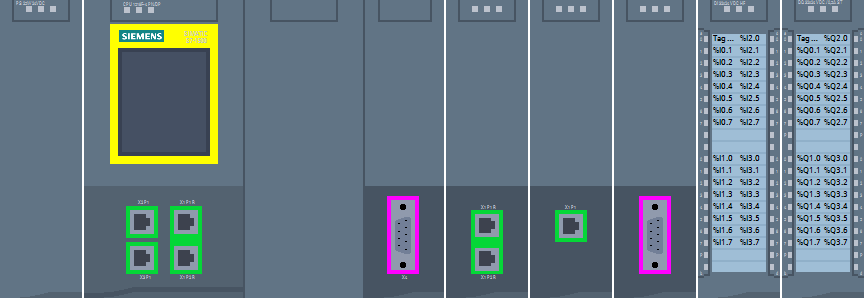
# GUI for WebApplication Deployment 
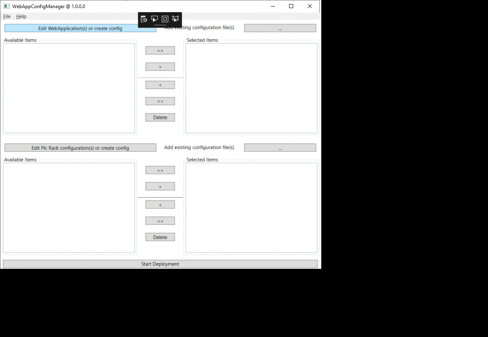

On the MainWindow you can select the webapps to deploy and the racks you want to deploy to:

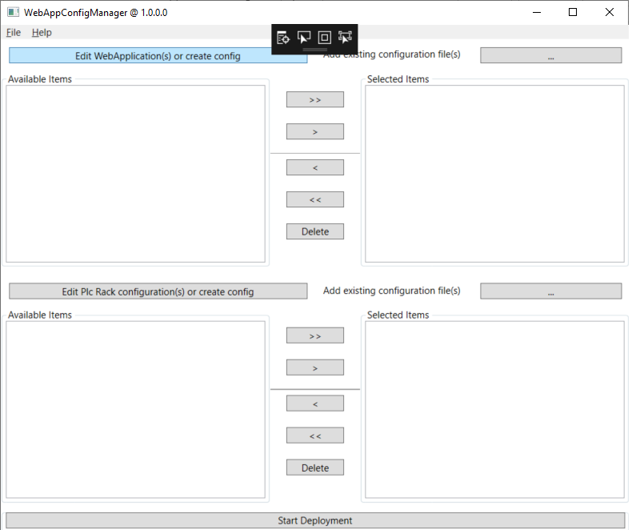
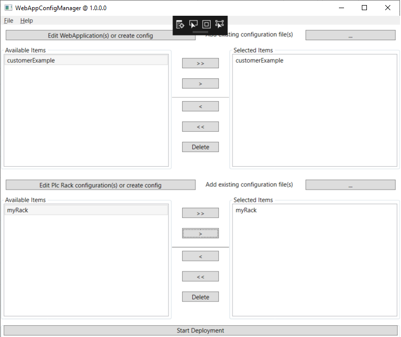

With the Edit Application(s) or create config button you can open the WebAppConfigCreatorWindow

# WebAppConfigCreatorWindow
On the WebAppConfigCreatorWindow 
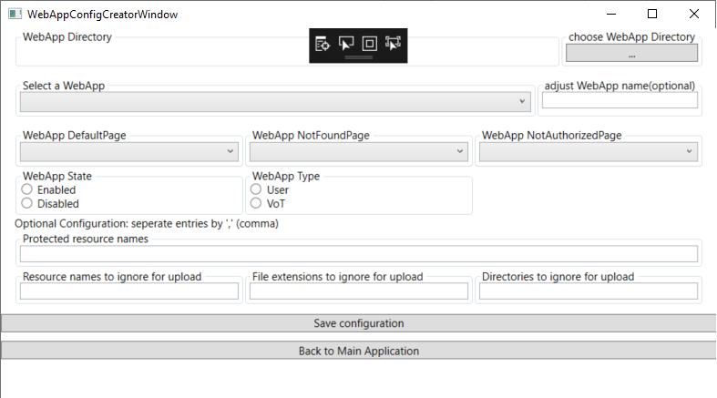

you can select your WebAppdirectory

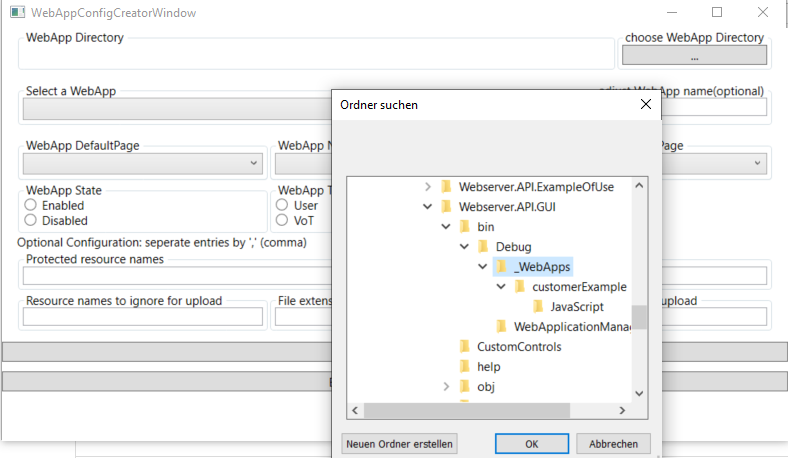

Select the app you want to configure

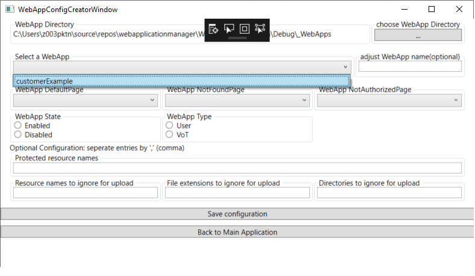

Do the configuration

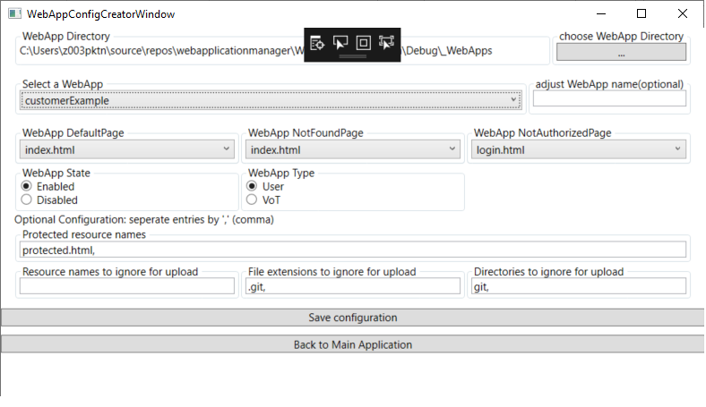

Save it (into a WebAppConfig.json file in the directory of the webapp) and go back to the Mainwindow
# Mainwindow

Or you can also add an already existing configuration file of your WebApplication

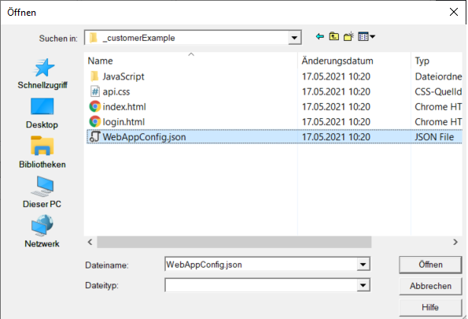

Also you can Open the

# PlcRackConfigCreatorWindow
Where you can add a Plc Rack configuration and edit Plc Rack configurations:

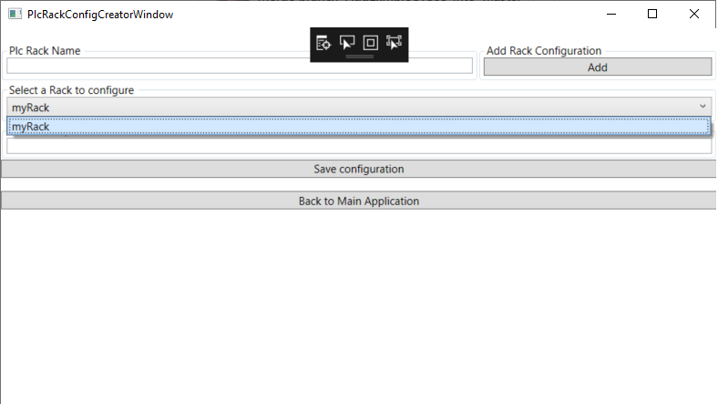

Save it and go back to the MainWindow.

# Mainwindow
Or you can also add an already existing configuration file of your PlcRackConfiguration

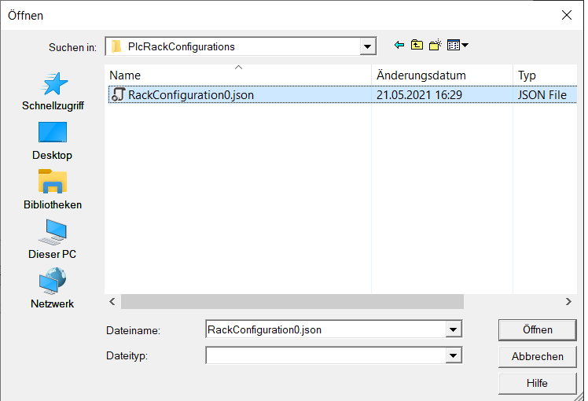

When you are done configuring and selecting the configurations you want to deploy to you can start the Deployment of the Apps to the Racks:

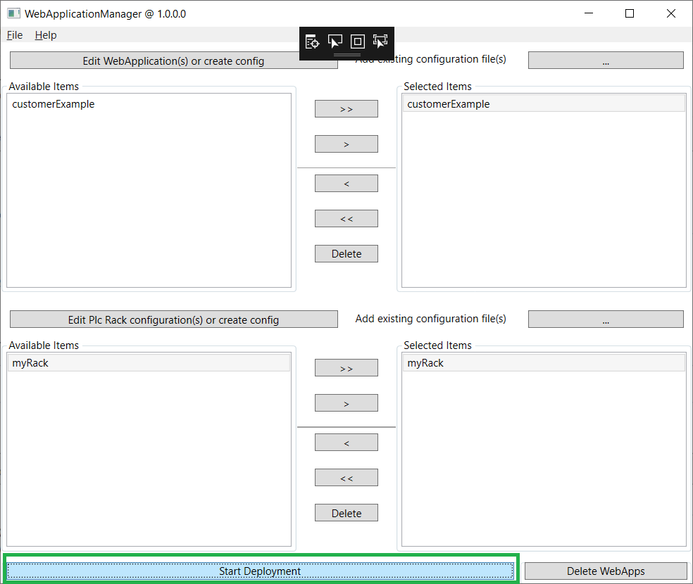

you'll be prompted for the Login credentials - Credentials of the configured User from TIA Portal (which wont be saved)

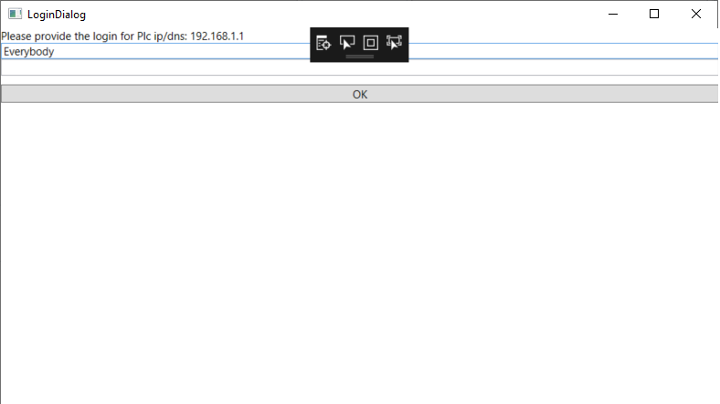

and optionally if the certificate of any plc is not in your trustlist:

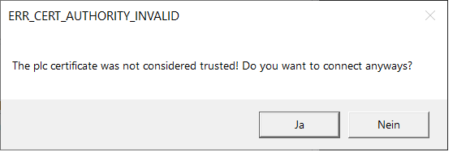

You'll have to decide wether you want to connect and trust to the earlier provided IP/DNS or not.

Once the deployment is finished you'll receive a message:

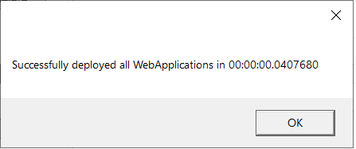

You can also delete your WebApplication(s):

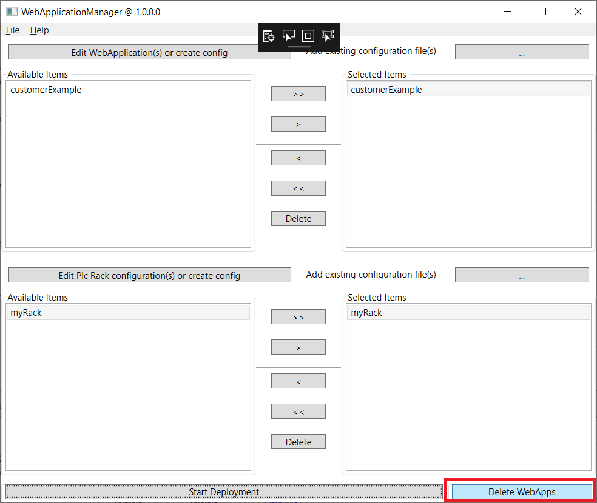

Again once the WebApps are deleted you'll receive a message.