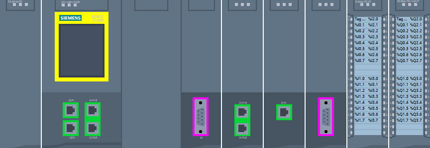
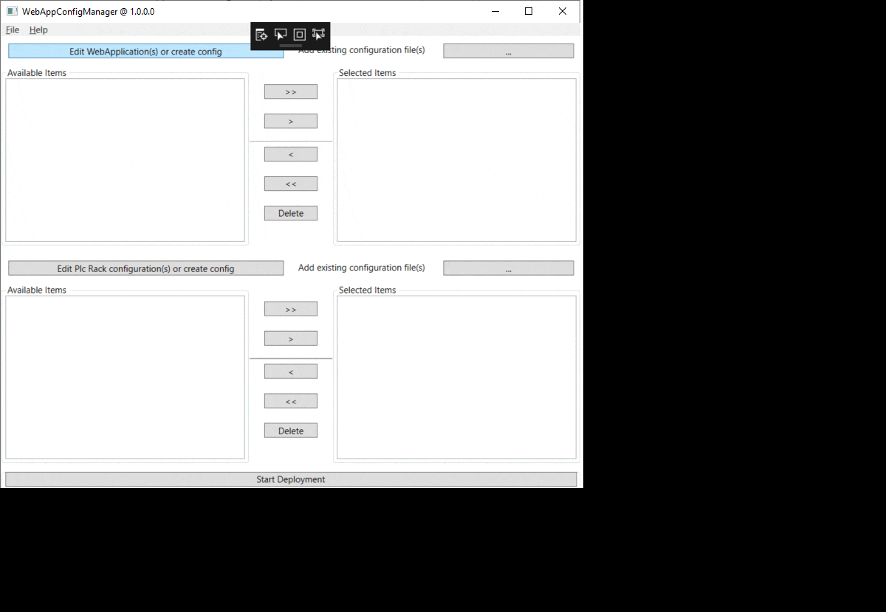
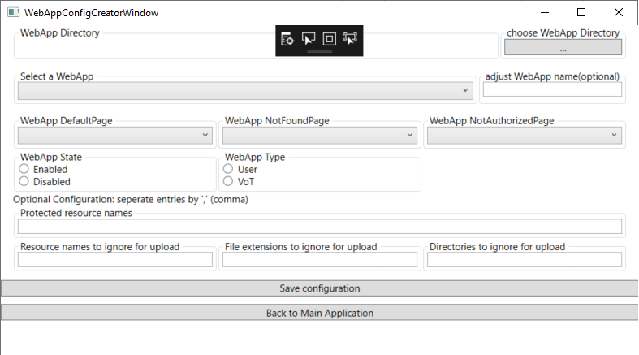
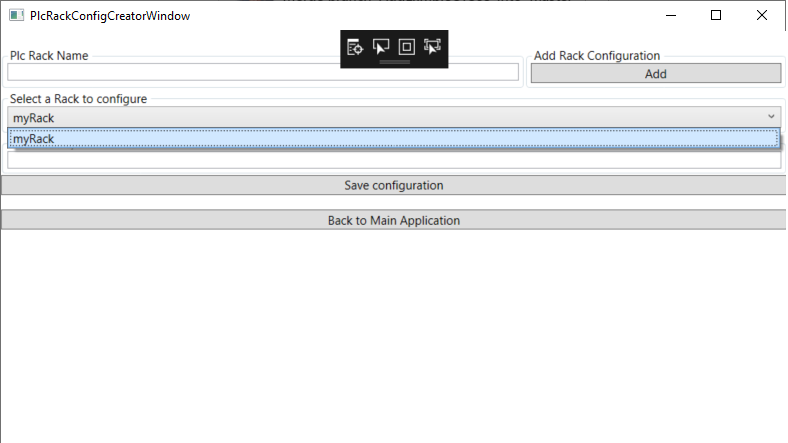

# WebApplicationManager



**Professional GUI for deploying web applications to Siemens industrial PLCs.**

## v2.0 - Now on .NET 10 LTS

- ? Upgraded to .NET 10 (Long-Term Support until Nov 2026)
- ? 20-30% faster performance
- ? 100% backward compatible with v1.0
- ? All settings automatically preserved

## Quick Start

1. **Install .NET 10 Desktop Runtime**
   - https://dotnet.microsoft.com/download/dotnet/10.0
   - Choose "Desktop Runtime"

2. **Install WebApplicationManager**
   - Run the installer
   - Done!

## System Requirements

- Windows 7 SP1 or later
- .NET 10 Desktop Runtime ([download](https://dotnet.microsoft.com/download/dotnet/10.0))
- 200 MB disk space

**Full requirements:** See [.NET 10 docs](https://learn.microsoft.com/dotnet/core/install/windows)

## Features

### Web App Deployment


Deploy applications to multiple PLCs with real-time status tracking.

### Application Configuration  


Create and manage web app configurations with an intuitive wizard.

### PLC Management


Configure and manage multiple PLC racks.

### Advanced
- Multi-monitor support
- Detailed logging
- Settings persistence
- Secure authentication

## Upgrading from v1.0?

See **[MIGRATION_GUIDE.md](MIGRATION_GUIDE.md)** - it's simple and non-breaking!

**Key points:**
- ? All your settings load automatically
- ? All PLC configurations preserved
- ? No configuration needed
- ? Just install .NET 10 and the new app

## Documentation

- **[SYSTEM_REQUIREMENTS.md](SYSTEM_REQUIREMENTS.md)** - System setup and .NET 10 installation
- **[MIGRATION_GUIDE.md](MIGRATION_GUIDE.md)** - Upgrade from v1.0 to v2.0
- **[DEPLOYMENT.md](DEPLOYMENT.md)** - Enterprise deployment and automation

## Technical Details

**Stack:**
- .NET 10.0 LTS
- WPF + Windows Forms
- Siemens S7 Webserver API v3.2.27
- Newtonsoft.Json v13.0.4

**Architecture:** Single-threaded UI with async task execution, event-driven logging, persistent JSON configuration.

## What Changed from v1.0

| Feature | v1.0 | v2.0 |
|---------|------|------|
| Framework | .NET Framework 4.8 | .NET 10 LTS |
| Performance | Standard | +20-30% |
| Security | Windows Update | Monthly .NET updates |
| Compatibility | ? | ? 100% backward compatible |
| Support Until | 2029 | November 2026 |

## Troubleshooting

**App won't start?**
```powershell
dotnet --version  # Should show 10.0.x or higher
```

**Settings not loading?**
Check: `%APPDATA%\WebApplicationManager\Settings\`

**PLC connection fails?**
Verify network connectivity and PLC is online.

See [.NET 10 install guide](https://learn.microsoft.com/dotnet/core/install/windows) for more help.

## Links

- **Download .NET 10:** https://dotnet.microsoft.com/download/dotnet/10.0
- **.NET 10 Documentation:** https://learn.microsoft.com/dotnet/
- **Siemens S7 Webserver:** https://support.industry.siemens.com/

---

**Version:** 2.0  
**.NET:** 10.0 LTS  
**Status:** Production Ready ?